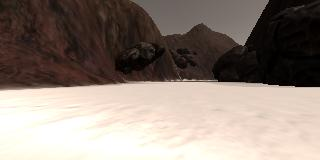
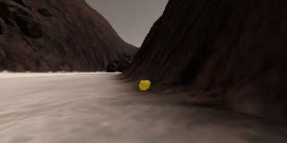

## Project: Search and Sample Return
---

**The goals / steps of this project are the following:**  

**Training / Calibration**  

* Download the simulator and take data in "Training Mode"
* Test out the functions in the Jupyter Notebook provided
* Add functions to detect obstacles and samples of interest (golden rocks)
* Fill in the `process_image()` function with the appropriate image processing steps (perspective transform, color threshold etc.) to get from raw images to a map.  The `output_image` you create in this step should demonstrate that your mapping pipeline works.
* Use `moviepy` to process the images in your saved dataset with the `process_image()` function.  Include the video you produce as part of your submission.

**Autonomous Navigation / Mapping**

* Fill in the `perception_step()` function within the `perception.py` script with the appropriate image processing functions to create a map and update `Rover()` data (similar to what you did with `process_image()` in the notebook). 
* Fill in the `decision_step()` function within the `decision.py` script with conditional statements that take into consideration the outputs of the `perception_step()` in deciding how to issue throttle, brake and steering commands. 
* Iterate on your perception and decision function until your rover does a reasonable (need to define metric) job of navigating and mapping.  

[//]: # (Image References)

[image1]: ./misc/rover_image.jpg
[image2]: ./calibration_images/example_grid1.jpg
[image3]: ./calibration_images/example_rock1.jpg 

## [Rubric](https://review.udacity.com/#!/rubrics/916/view) Points
### Here I will consider the rubric points individually and describe how I addressed each point in my implementation.  

---
### Writeup / README

### Notebook Analysis
#### 1. Run the functions provided in the notebook on test images (first with the test data provided, next on data you have recorded). Add/modify functions to allow for color selection of obstacles and rock samples.
I tested with provided test images as well as the following images that I recorded in my simulator  

To identify rocks, navigable terrain and obstacles i wrote three color threshold functions:  
* `ground_thresh`: This function identifies as ground if RGB > (160,160,160)  
* `obstacle_thresh`: This function idenities as obstacle if RGB < (160,160,160)  
* `rock_thresh`: For identifying rocks I use HSV to identify them and to do so I first converted the image to be read in CV2 package. Since it reads it in BGR I first converted from BGR2HSV and then found the rock sample in HSV and use the resulting image to create a mask for thresholding. 

#### 1. Populate the `process_image()` function with the appropriate analysis steps to map pixels identifying navigable terrain, obstacles and rock samples into a worldmap.  Run `process_image()` on your test data using the `moviepy` functions provided to create video output of your result. 

I filled the process_image as follows 
1. I idenitifed source and destination points for perspective transform 
2. I created a warped image 
3. Using the thresholding fucntions I had defined, i created three thresholded images, one each for navigatable terrain, obstacle and rocks. 
4. Then I proceeded to convert the three thresholded images to rover coordinates 
5. I converted the images from rover coordinates to world coordinates
6. Then i mapped the world coordinate pixels on the world map
7. I then created the output images for rendering my analysis; i did not make any changes here and kept the original code.   

The resulting video is here [Video](../output/test_mapping.mp4)

### Autonomous Navigation and Mapping

#### Test Environment
2012 Macbook pro running macOS Sierra.  
The simulator was run with *1024 X 768* resolution and graphics quality was set as *Good* and FPS is 17.

#### 1. Fill in the `perception_step()` (at the bottom of the `perception.py` script) and `decision_step()` (in `decision.py`) functions in the autonomous mapping scripts and an explanation is provided in the writeup of how and why these functions were modified as they were.

##Percerption
This step does all the analysis required for making decisions. Specificall it identifies obstacles, rocks, and navigatable terrain. To aid some decisions in the Rover class I added also dist and angles for obstacles and rocks. The perception step pretty much uses the thresholding functions from the Notebook and with one change, I give a bit more emphasis to navigatable terrain on the world map.  To improve the fidelity I discard images that have high pitch and roll as they indicate the rover may have been bouncing or other wise unstable. 
 
##Decision
I added two more modes to the Rover: circles and stuck. I detect the rover is going in circles if it completes a 360 circle (clockwise or anitclockwise) based on the changes in yaw angle. I identify the rover is stuck if its speed ~0 or dist travelled ~0. Depending on these conditions i take different actions.   

Next i modified the rover forward mode to try and hug the left side of the wall. I noted that approx angles i needed to maintain was correlated and adjusted to the width of the terrain and adjusted steering angles accordingly.  

 

#### 2. Launching in autonomous mode your rover can navigate and map autonomously.  Explain your results and how you might improve them in your writeup.  

**Note: running the simulator with different choices of resolution and graphics quality may produce different results, particularly on different machines!  Make a note of your simulator settings (resolution and graphics quality set on launch) and frames per second (FPS output to terminal by `drive_rover.py`) in your writeup when you submit the project so your reviewer can reproduce your results.**

The Rover is mostly successful in getting out of corners and blocked state in good time. If given the time, I would have liked to make the rover not visit previously mapped areas. 

![alt text][image3]

z	